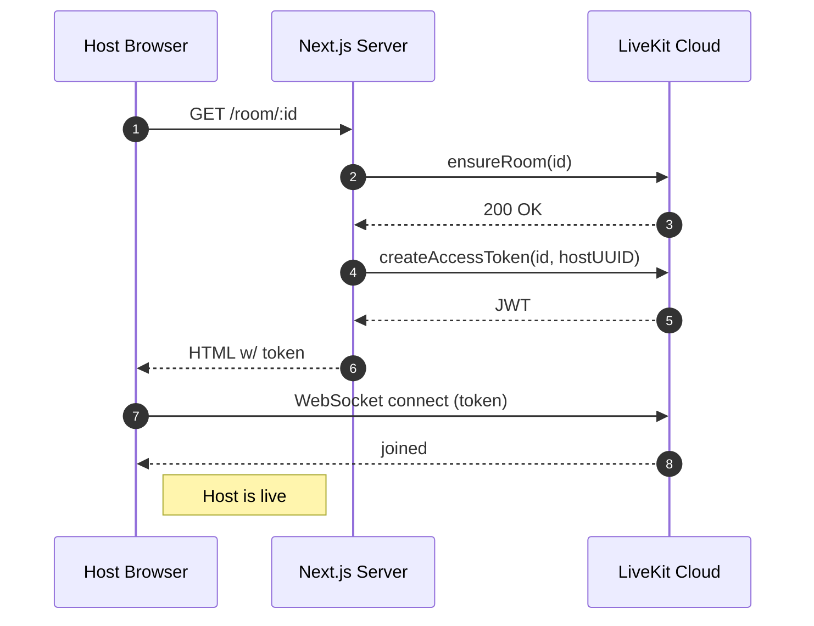

# Spaces Mini-App – User Flows

This document outlines every major interaction scenario in **Spaces**, from landing on the site to ending an audio room. Use it as a high-level reference for UX decisions, QA, or future feature planning.

---

## 1. Host – “Start a Space”

1. **Landing:**
   - User opens `spaces.xyz` (or Warpcast Frame → “Open in browser”).
   - Optional wallet connect panel appears.
   - Click **Start a Space** → generates `roomId = crypto.randomUUID()`.
   - Redirect to `/room/<roomId>?host=true`.

2. **Server actions:**
   1. `ensureRoom(roomId)` → LiveKit REST creates the room if it doesn’t exist.
   2. `generateAccessToken({ roomName, userId })` → returns signed JWT.

3. **Client connect:**
   - `LiveKitRoom` connects to WebSocket; host becomes first participant.
   - UI shows ControlBar (mic on) & ParticipantList (count = 1).

4. **(Planned) Broadcast Frame:**
   - Host clicks “Share Frame” → `/api/frame` renders Frame content.
   - Followers receive notification + Frame with **Join Space** button.

---

## 2. Listener – Join via Link / Frame

### 2.1 Via landing page

- Paste room ID → **Join** → `/room/<id>`.

### 2.2 Via Frame inside Warpcast

- User sees Frame (“Alice started a Space · 3 listening”).
- Click **Join** → opens in in-app browser.

### 2.3 Token flow repeats

- Server generates JWT, page renders `AudioRoom`, client joins muted.

---

## 3. In-Room Interaction

| Function           | Implementation                                  |
| ------------------ | ----------------------------------------------- |
| Controls           | `ControlBar` (mic toggle, leave)                |
| Participant roster | `ParticipantList` updates on connect/disconnect |
| Active speaker     | Highlight via `activeSpeakersChanged`           |
| Host ends space    | (Planned) `roomService.deleteRoom` & disconnect |

---

## 4. Tipping Flow _(upcoming)_

1. User taps 💰 near host/speaker.
2. `wagmi` opens Base MiniKit modal to tip in USDC.
3. On success, client `publishData({ type: 'tip', amount, from })`.
4. All participants render confetti & update totals.

---

## 5. Notifications & Account Association

1. User enables notifications in Frame.
2. Webhook `/api/webhook` stores `notificationDetails` in Redis.
3. When a followed host starts a Space, server sends Neynar push.

---

## 6. Error & Edge Cases

| Case             | Handling                                               |
| ---------------- | ------------------------------------------------------ |
| Invalid room ID  | Show “Space not found” modal; offer **Return Home**    |
| Token expired    | Catch `TokenExpired` → request new token               |
| Host disconnects | LiveKit cleans up when room empty; re-creation allowed |

---

## Sequence Diagram – Host flow

---

## Roadmap Snapshot

- [x] Audio-only rooms
- [ ] Tipping (Base MiniKit)
- [ ] Dynamic Frame OG image (listener count)
- [ ] Host analytics / leaderboard

---

_Maintained by the Spaces core team – contributions welcome!_
